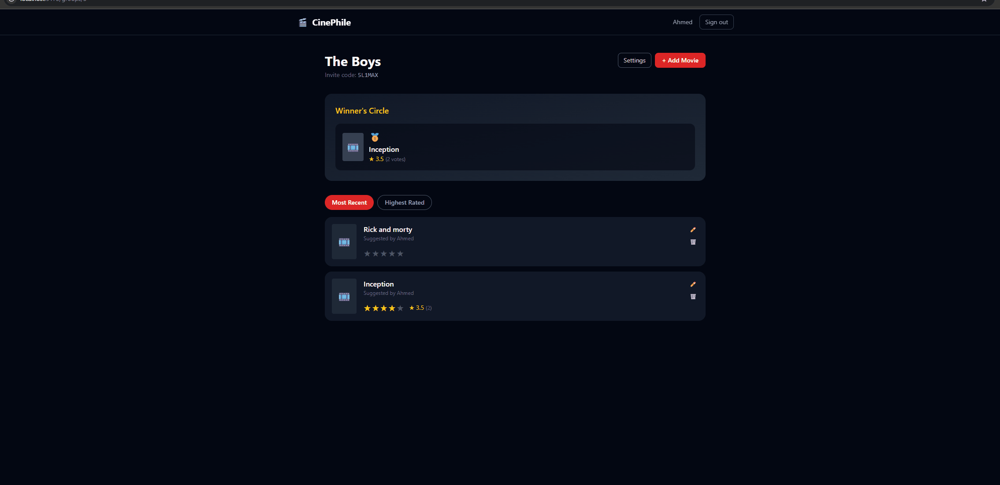
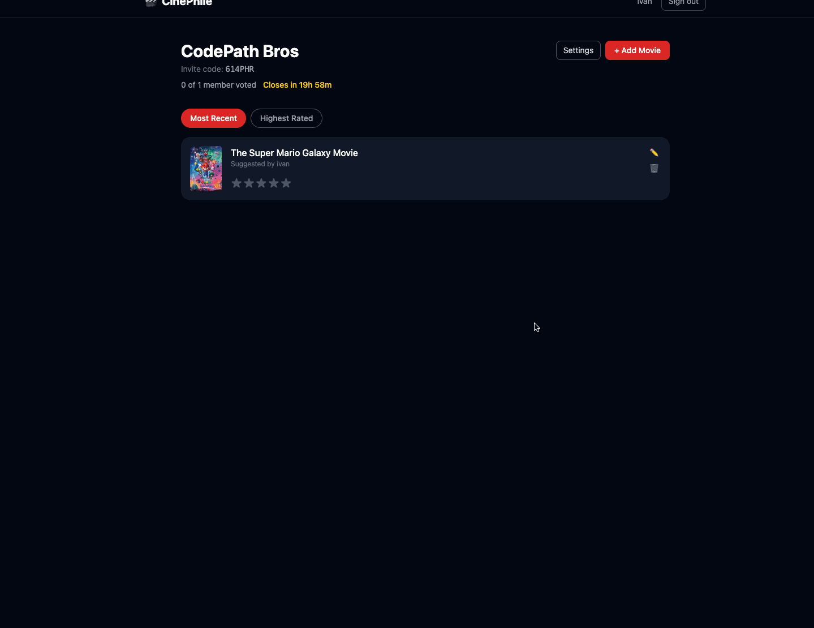
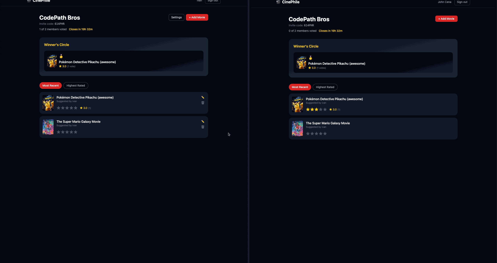
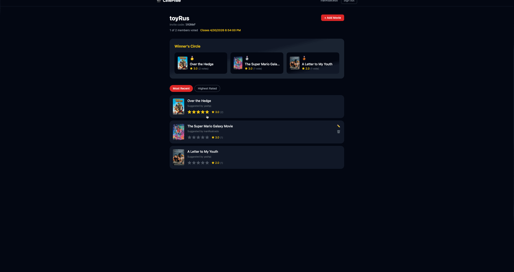
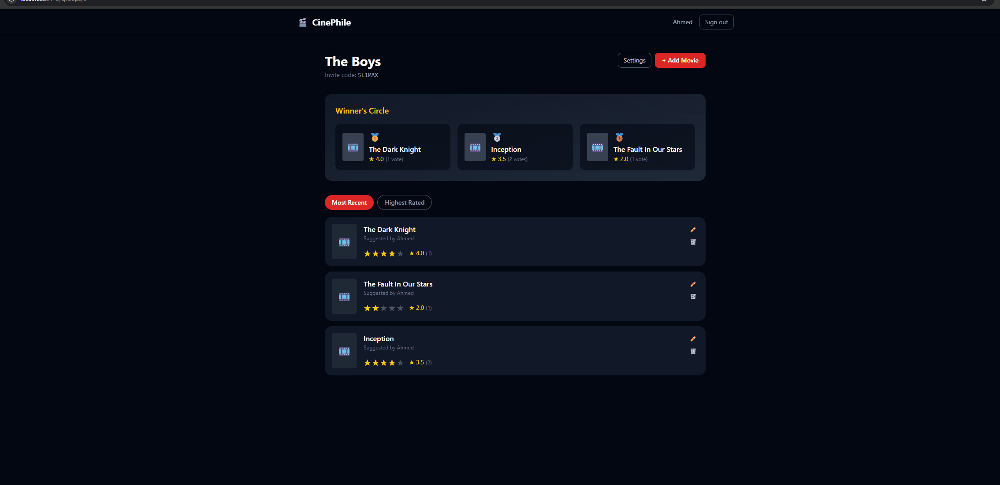
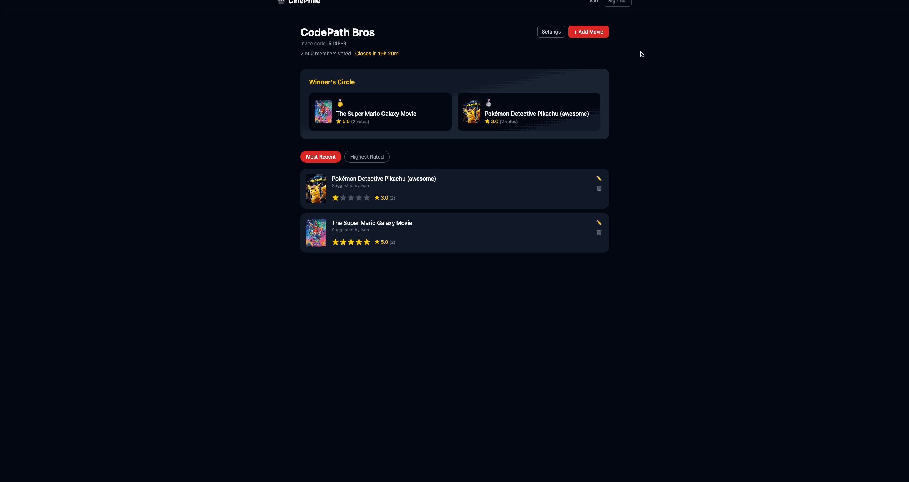
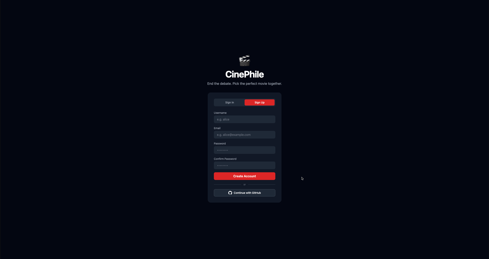

# CinePhile

CodePath WEB103 Final Project

Designed and developed by: [Yash, Ivan & Ahmed]

🔗 [Link to deployed app](https://cinephile-uimo.onrender.com/)

## About

### Description and Purpose
CinePhile is a social movie-discovery application designed to end the "what should we watch?" debate. It allows users to form private groups where members can suggest movies and collectively vote on them. By aggregating these votes, the app provides a dynamic "Top 3" list, ensuring that every movie night is backed by the group’s consensus.

### Inspiration
The inspiration for CinePhile came from the common frustration of scrolling through streaming services for hours with friends without ever picking a film. While apps like Letterboxd are great for individual tracking, they lack a collaborative, democratic tool for small groups to make real-time decisions.

## Tech Stack

Frontend: React, React Router, Tailwind CSS

Backend: Node.js, Express, PostgreSQL, Socket.io (for Live Voting)

## Features

### Group Creation & Admin Controls ✅
Users can create custom movie groups and serve as Admins to manage membership, ensuring a private space for friends or family.



### Collaborative Movie Suggestions ✅
Any member of a group can search for and add movies using the TMDB API, building a shared "Suggestion Pool" of potential films to watch.



### Live Collaborative Voting ✅
Members can vote on movies in real-time. The app uses web sockets to ensure that when one person votes, the scores and rankings update instantly for everyone else in the group. (Stretch Feature)



### Dynamic Top 3 Leaderboard ✅
The app automatically calculates the average scores and displays the top 3 highest-rated movies in a prominent "Winner's Circle" section.



### Multi-Criteria Sorting ✅
Users can toggle between sorting movies by "Highest Rated" or "Most Recent" to better organize large suggestion lists. (Custom Feature)



### Real-Time Input Validation ✅
The app validates movie entries to prevent duplicate suggestions within the same group and ensures all required fields are filled before submission. (Custom Feature)



### GitHub Authentication ✅
Users can securely log in and log out using GitHub OAuth.



## Installation Instructions

### 1. Clone the repository

```bash
git clone https://github.com/yashpj/web103_finalproject.git
cd web103_finalproject
```


### 2. Setup Backend (server)

```
cd server
npm install
```


Create a .env file inside /server and add:

```
DATABASE_URL=your_postgresql_connection_string
GITHUB_CLIENT_ID=your_github_client_id
GITHUB_CLIENT_SECRET=your_github_client_secret
GITHUB_CALLBACK_URL=http://localhost:3001/auth/github/callback
FRONTEND_URL=http://localhost:5173
TMDB_API_KEY=your_tmdb_api_key
```

Start backend:
```
npm run dev
```

### 3. Setup Frontend (client)

```
cd ../client
npm install
npm run dev
```

### 4. Open the app

Frontend: http://localhost:5173
Backend: http://localhost:3001


### Notes

* PostgreSQL must be running
* .env must be inside /server
* GitHub OAuth callback must match exactly:
    http://localhost:3001/auth/github/callback
* Use two terminals (client + server)