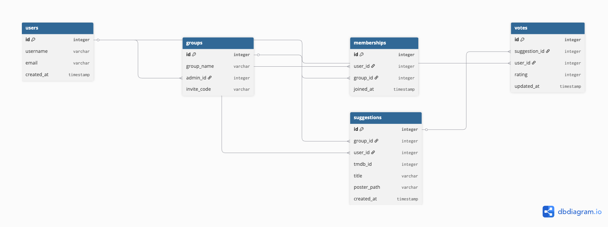

# Entity Relationship Diagram

This diagram visualizes the database schema for CinephileConnect, including the many-to-many relationship between users and groups.

## Description of Tables

* **users**: Stores member credentials and profiles.
* **groups**: Contains group names and references the admin.
* **memberships**: The join table connecting users to multiple groups.
* **suggestions**: Tracks movies added to a group pool.
* **votes**: Records the 1-5 star ratings for each suggestion.

## Create the List of Tables

// CinephileConnect ERD

Table users {
  id integer [primary key]
  username varchar
  email varchar
  created_at timestamp
}

Table groups {
  id integer [primary key]
  group_name varchar
  admin_id integer [ref: > users.id] // One-to-Many
  invite_code varchar [unique]
}

Table memberships {
  id integer [primary key]
  user_id integer [ref: > users.id]
  group_id integer [ref: > groups.id]
  joined_at timestamp
}

Table suggestions {
  id integer [primary key]
  group_id integer [ref: > groups.id]
  user_id integer [ref: > users.id]
  tmdb_id integer // ID from the movie database
  title varchar
  poster_path varchar
  created_at timestamp
}

Table votes {
  id integer [primary key]
  suggestion_id integer [ref: > suggestions.id]
  user_id integer [ref: > users.id]
  rating integer // 1 to 5
  updated_at timestamp
}
